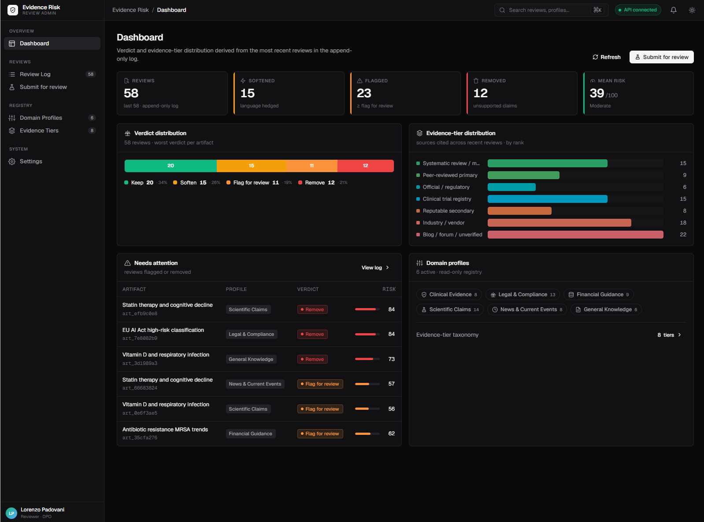
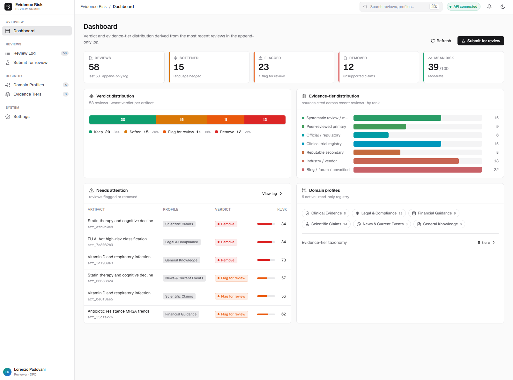
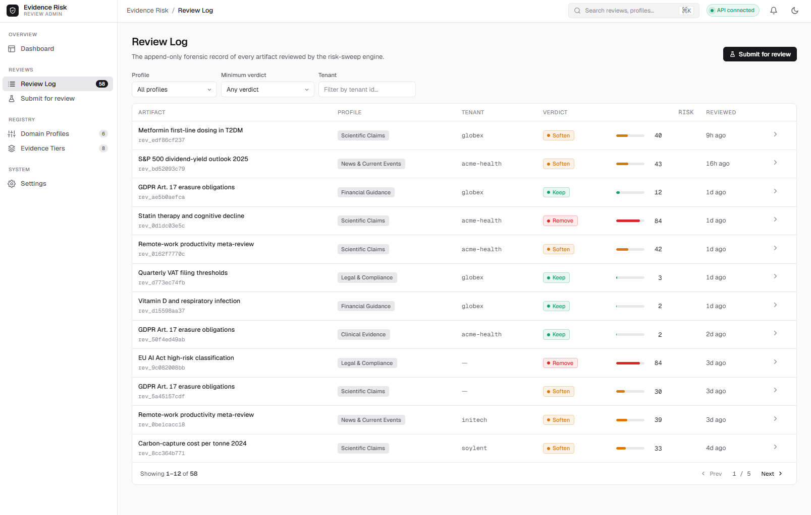
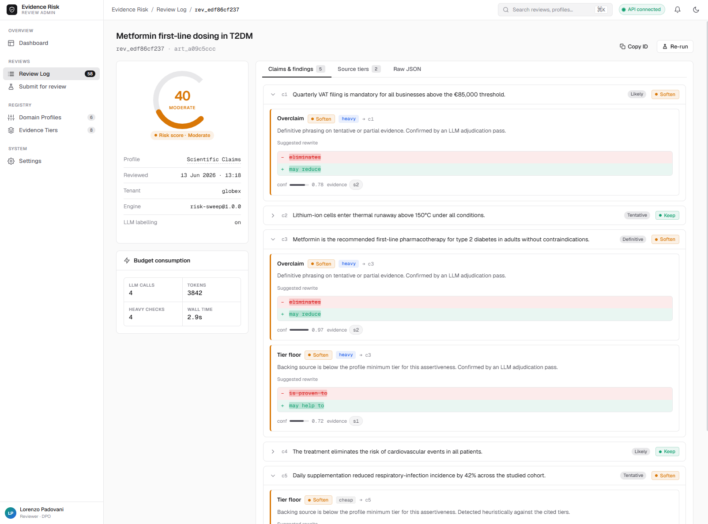
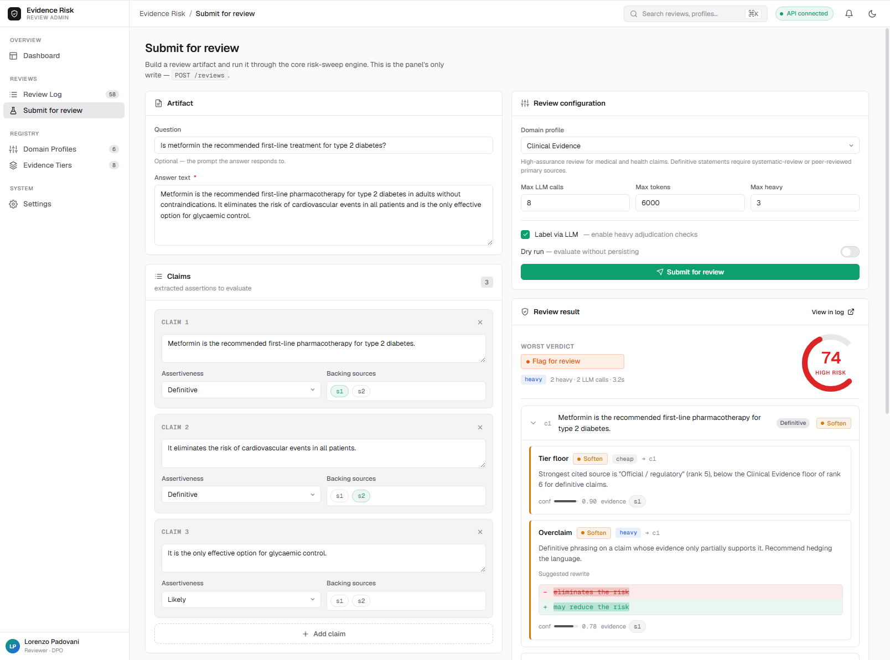
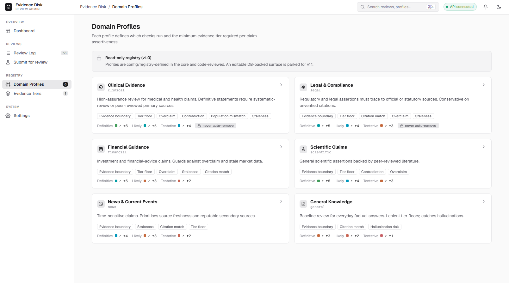
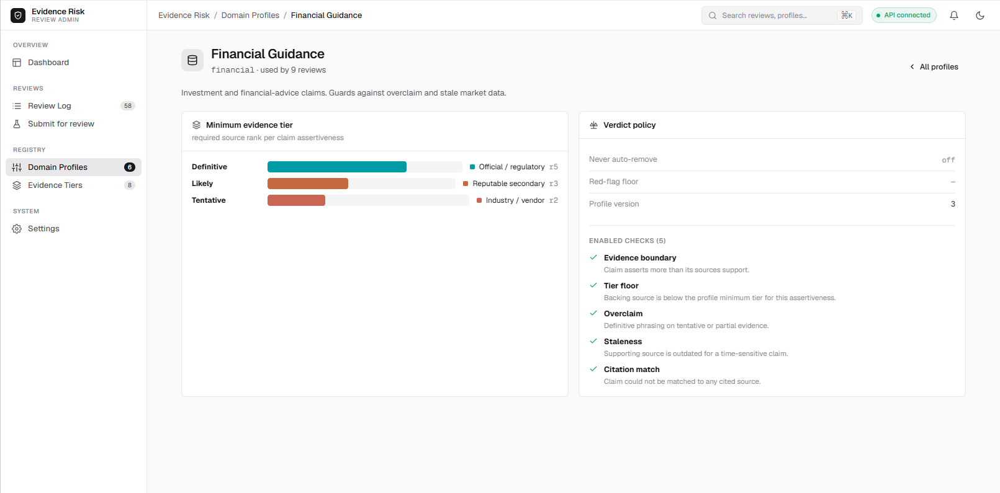
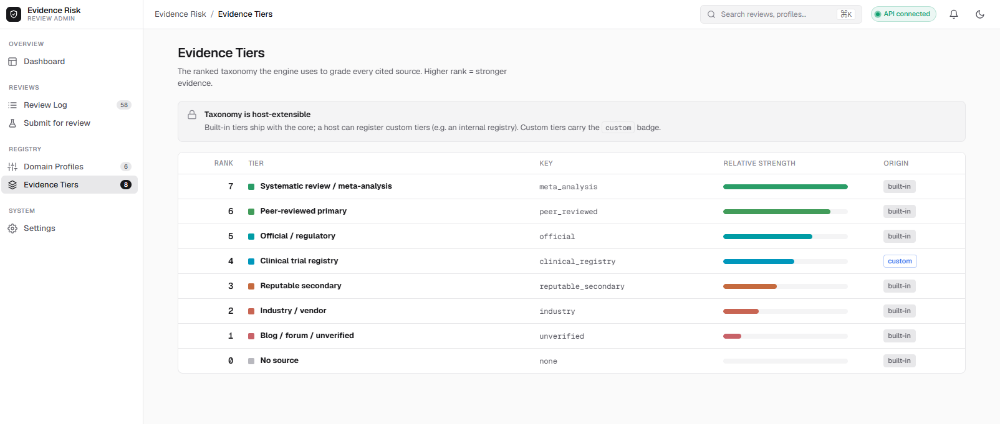
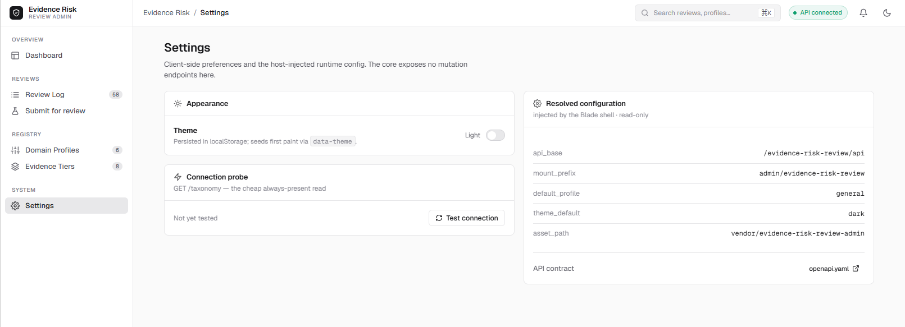

# Laravel Evidence Risk Review Admin

[](https://packagist.org/packages/padosoft/laravel-evidence-risk-review-admin)
[](https://www.php.net/)
[](https://laravel.com/)
[](LICENSE)

The operator window for `padosoft/laravel-evidence-risk-review`: browse review logs, inspect findings, submit trial artifacts, and verify evidence-tier/profile configuration from any Laravel app.



## Table Of Contents

- [Why It Exists](#why-it-exists)
- [Screenshots](#screenshots)
- [Install](#install)
- [Configuration](#configuration)
- [Routes And Assets](#routes-and-assets)
- [Core API Contract](#core-api-contract)
- [Embedded Mount](#embedded-mount)
- [Testing](#testing)
- [AI Agent Pack](#ai-agent-pack)
- [Security](#security)
- [Contributing](#contributing)
- [Changelog](#changelog)
- [License](#license)

## Why It Exists

The core package performs evidence-boundary and risk-sweep review. This package is the human-facing admin panel over that HTTP API. It intentionally does not duplicate core business logic: all reviews, profiles, taxonomy, and findings come from the configured API base.

```
Laravel host
  ├─ padosoft/laravel-evidence-risk-review        # core HTTP API
  └─ padosoft/laravel-evidence-risk-review-admin  # this React admin panel
```

What is included:

- Dashboard over recent review activity.
- Review log browser with profile/verdict/tenant filters.
- Review detail with findings, budget and source tiers.
- Try-it form for POST `/reviews`.
- Read-only domain profiles and evidence-tier taxonomy.
- Settings with resolved runtime config, theme toggle and connection probe.
- Playwright coverage against the production bundle with only the external core API mocked.

## Screenshots










## Install

Install the core package first and enable its HTTP API in your host app.

```bash
composer require padosoft/laravel-evidence-risk-review
composer require padosoft/laravel-evidence-risk-review-admin
```

Publish the admin config:

```bash
php artisan vendor:publish --tag=evidence-risk-review-admin-config
```

Publish prebuilt assets after release builds:

```bash
php artisan vendor:publish --tag=evidence-risk-review-admin-assets
```

Set host auth middleware and the core API base:

```dotenv
EVR_ADMIN_PREFIX=admin/evidence-risk-review
EVR_ADMIN_MIDDLEWARE=web,auth
EVR_ADMIN_API_BASE=/evidence-risk-review/api
EVR_ADMIN_THEME=dark
```

Visit:

```text
/admin/evidence-risk-review
```

## Configuration

```php
return [
    'mount_prefix' => env('EVR_ADMIN_PREFIX', 'admin/evidence-risk-review'),
    'middleware' => ['web', 'auth'],
    'api_base' => env('EVR_ADMIN_API_BASE', '/evidence-risk-review/api'),
    'theme_default' => env('EVR_ADMIN_THEME', 'dark'),
    'asset_path' => env('EVR_ADMIN_ASSET_PATH', 'vendor/evidence-risk-review-admin'),
];
```

`middleware` never resolves empty. If `EVR_ADMIN_MIDDLEWARE` is blank, the package falls back to `web`.

## Routes And Assets

The Laravel side exposes one catch-all shell route under `mount_prefix`. React owns client-side routing after the Blade shell loads.

Assets are built with Vite into:

```text
public/vendor/evidence-risk-review-admin
```

Build locally:

```bash
npm ci
npm run build
```

## Core API Contract

The SPA consumes:

- `GET /reviews`
- `GET /reviews/{reviewId}`
- `POST /reviews`
- `GET /profiles`
- `GET /profiles/{key}`
- `GET /taxonomy`
- `GET /openapi.yaml`

If the core API is unavailable, screens render explicit error/unavailable states.

## Embedded Mount

The bundle exports:

```tsx
import { EvidenceRiskReviewAdminApp } from '@padosoft/laravel-evidence-risk-review-admin';

<EvidenceRiskReviewAdminApp
  embedded
  config={{ api_base: '/evidence-risk-review/api', mount_prefix: 'admin/evidence-risk-review' }}
/>
```

Use embedded mode when a host SPA provides its own navigation chrome.

## Testing

```bash
composer validate --strict --no-check-publish --no-interaction --no-ansi
vendor/bin/pint --test
vendor/bin/phpstan analyse --memory-limit=512M --no-progress
vendor/bin/phpunit

npm ci
npm run typecheck
npm run build
npm run test
npm run test:e2e
```

Playwright runs the real production bundle. `page.route` is used only for the external core HTTP API.

## AI Agent Pack

This repository ships durable agent context:

- `AGENTS.md`
- `CLAUDE.md`
- `docs/RULES.md`
- `docs/IMPLEMENTATION_PLAN.md`
- `docs/LESSON.md`
- `docs/PROGRESS.md`
- `.claude/skills/*`

These files document branch flow, gates, final deep review policy, and package guardrails.

## Security

This package is not an auth provider. Production hosts must protect `EVR_ADMIN_PREFIX` with authenticated middleware.

Report vulnerabilities through the process in [SECURITY.md](SECURITY.md).

## Contributing

See [CONTRIBUTING.md](CONTRIBUTING.md).

## Changelog

See [CHANGELOG.md](CHANGELOG.md).

## License

Apache-2.0. See [LICENSE](LICENSE).
